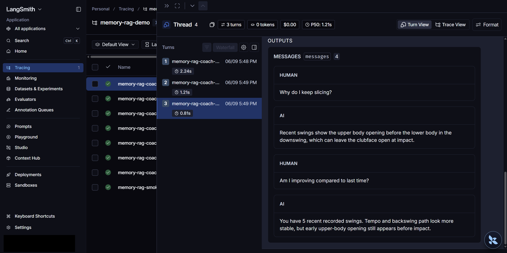
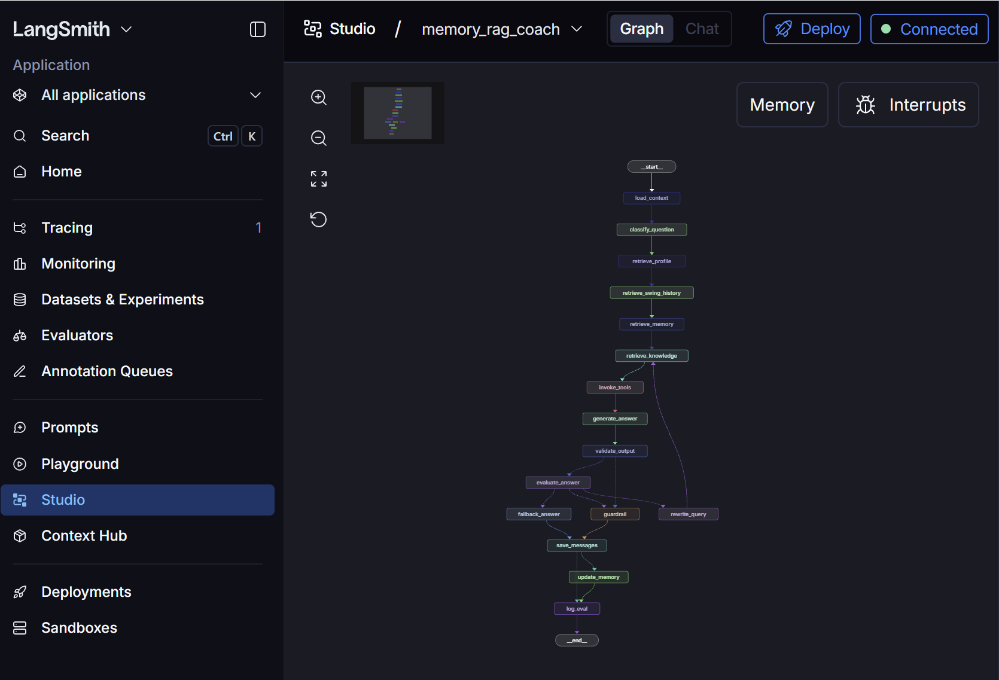

# MemoryRAG

<p align="center">
  
</p>
<p align="center">
  
</p>

Demo stack for an AI golf swing coach: a FastAPI backend with long-term memory and RAG, plus a React/Vite mobile-style frontend.

| Path | Role |
|------|------|
| [demo/be](demo/be) | API, 16-node LangGraph coach workflow (quality loop + tools), MySQL |
| [demo/fe](demo/fe) | Demo UI — dev server proxies `/api` to the backend on port 8000 |

Local development runs without cloud API keys. Defaults use a mock LLM and SQL-only retrieval (`LLM_PROVIDER=mock`, `VECTOR_STORE_PROVIDER=none`).

More detail: [demo/be/README.md](demo/be/README.md) · [demo/fe/README.md](demo/fe/README.md)

## Prerequisites

- **Docker** — MySQL 8 for the backend
- **Python 3.11+** — backend
- **pnpm** — frontend ([install](https://pnpm.io/installation))

## First-time setup

### 1. Database (MySQL)

```bash
cd demo/be/infra/docker
cp .env.example .env   # set local passwords (gitignored)
docker compose up -d
```

MySQL listens on `localhost:3306`; database and credentials are in `infra/docker/.env` (see `.env.example`).

### 2. Backend

```bash
cd demo/be
cp .env.example .env   # DB_PASSWORD must match MYSQL_PASSWORD in infra/docker/.env

python -m venv .venv
source .venv/bin/activate   # Windows: .\.venv\Scripts\activate
pip install -r requirements.txt

export PYTHONPATH=.         # Windows: $env:PYTHONPATH="."
alembic upgrade head
python scripts/seed_demo_data.py
```

Seed creates demo user **Riley** (`user_id=1` in a fresh database).

**No Docker?** Use SQLite instead — see [demo/be/scripts/setup_sqlite_local.py](demo/be/scripts/setup_sqlite_local.py).

### 3. Frontend

```bash
cd demo/fe
pnpm install
```

In dev, Vite proxies `/api` → `http://127.0.0.1:8000`, so you usually do **not** need a `.env.local` file.

Optional overrides in `demo/fe/.env.local`:

```env
VITE_API_BASE_URL=http://localhost:8000
VITE_DEMO_USER_ID=1
```

## Run the servers

Use two terminals. Start the backend first so the UI can reach it.

**Terminal 1 — API (port 8000)**

```bash
cd demo/be
source .venv/bin/activate
export PYTHONPATH=.
uvicorn app.main:app --reload --host 0.0.0.0 --port 8000
```

Shortcut (creates `.env` from the example if missing on Windows):

```bash
cd demo/be
./scripts/run_local.sh          # macOS / Linux
# .\scripts\run_local.ps1       # Windows PowerShell
```

**Terminal 2 — UI (port 5173)**

```bash
cd demo/fe
pnpm dev
```

| Service | URL |
|---------|-----|
| Frontend | http://localhost:5173 |
| API docs | http://localhost:8000/docs |
| Health | http://localhost:8000/api/health |

Quick check:

```bash
curl http://localhost:8000/api/health
```

## Optional next steps

| Goal | Where to look |
|------|----------------|
| Real LLM (Gemini API key) | `LLM_PROVIDER=gemini_api` in [demo/be/.env.example](demo/be/.env.example) · `scripts/smoke_gemini_chat.py` |
| Vertex AI Gemini (GCP) | [demo/be/README.md](demo/be/README.md#real-llm-demo-mode-vertex-gemini) |
| LangGraph Studio / LangSmith tracing | [LangGraph / LangSmith (optional)](#langgraph--langsmith-optional) below |
| Live E2E (FE + BE running) | `pnpm test:e2e:stack` in `demo/fe` |
| GCP deploy checklist | [demo/be/docs/manual_setup_later.md](demo/be/docs/manual_setup_later.md) |

## LangGraph / LangSmith (optional)

Optional observability for the existing **16-node** coach workflow in `demo/be/app/graph/workflow.py`. Not required for the FE demo — FastAPI remains the production entrypoint.

**LangGraph** orchestrates the pipeline. **LangSmith** adds external tracing and **LangGraph Studio** lets you visualize and step through the graph locally (`memory_rag_coach` in [demo/be/langgraph.json](demo/be/langgraph.json)).

### LangSmith tracing

Set APAC tracing vars in `demo/be/.env` (one PAT for tracing and Studio):

```env
LANGSMITH_TRACING=true
LANGSMITH_ENDPOINT=https://apac.api.smith.langchain.com
LANGSMITH_PROJECT=memory-rag-demo
LANGSMITH_API_KEY=<your_apac_pat>
```

Start the API, call `POST /api/coach/chat`, then open **Tracing** at https://apac.smith.langchain.com and look for run name `memory-rag-coach-workflow`.

<p align="center">
  
</p>

Full smoke-test checklist: [demo/be/docs/langsmith_studio_setup.md](demo/be/docs/langsmith_studio_setup.md)

### LangGraph Studio

From `demo/be`, with MySQL seeded and the same `.env`:

```bash
source .venv/bin/activate
export PYTHONPATH=.
pip install -U "langgraph-cli[inmem]"
./scripts/run_studio.sh
```

Select graph **`memory_rag_coach`** in Studio (not the default `model → tools` template). On WSL2, use the tunnel URL printed by `run_studio.sh` — Windows browsers cannot reach `http://127.0.0.1:2024` inside WSL.

<p align="center">
  
</p>

Expected nodes:

```text
load_context → classify_question → retrieve_profile → retrieve_swing_history
→ retrieve_memory → retrieve_knowledge → invoke_tools → generate_answer
→ validate_output → evaluate_answer → (guardrail | rewrite_query | fallback_answer)
→ save_messages → (update_memory | log_eval) → log_eval
```

Setup details, sample input, and troubleshooting: [demo/be/docs/langgraph_studio_setup.md](demo/be/docs/langgraph_studio_setup.md)
