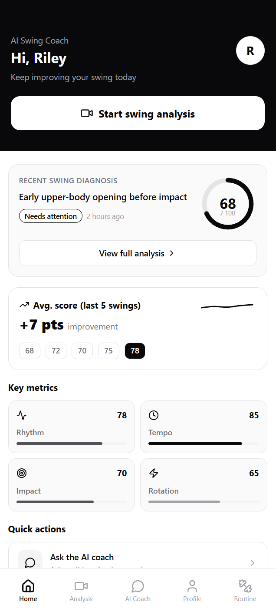
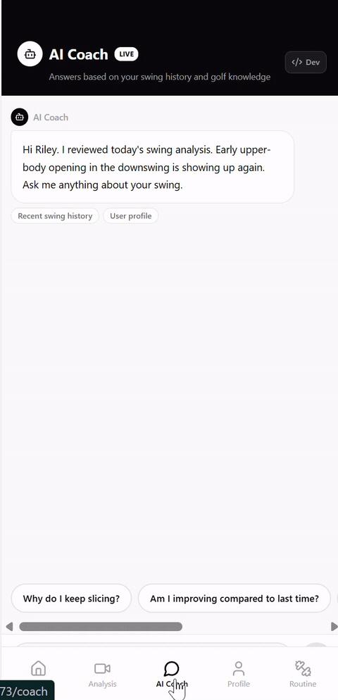

# MemoryRAG





Demo stack for an AI golf swing coach: a FastAPI backend with long-term memory and RAG, plus a React/Vite mobile-style frontend.

| Path | Role |
|------|------|
| [demo/be](demo/be) | API, LangGraph coach workflow, MySQL |
| [demo/fe](demo/fe) | Demo UI (talks to the API on port 8000) |

Local development runs without cloud API keys. Defaults use a mock LLM and SQL-only retrieval (`LLM_PROVIDER=mock`, `VECTOR_STORE_PROVIDER=none`).

## Prerequisites

- **Docker** — MySQL 8 for the backend
- **Python 3.11+** — backend
- **pnpm** — frontend ([install](https://pnpm.io/installation))

## First-time setup

### 1. Database (MySQL)

```powershell
cd demo/be/infra/docker
docker compose up -d
```

MySQL listens on `localhost:3306` with database `memoryrag` and credentials `memoryrag` / `memoryrag`.

### 2. Backend

```powershell
cd demo/be
copy .env.example .env

python -m venv .venv
.\.venv\Scripts\activate
pip install -r requirements.txt

$env:PYTHONPATH="."
alembic upgrade head
python scripts/seed_demo_data.py
```

Seed creates demo user **Riley** (`user_id=1` in a fresh database).

### 3. Frontend

```powershell
cd demo/fe
pnpm install
```

Optional: create `demo/fe/.env.local` to override defaults:

```env
VITE_API_BASE_URL=http://localhost:8000
VITE_DEMO_USER_ID=1
```

If you skip this file, the app uses the same defaults.

## Run the servers

Use two terminals. Start the backend first so the UI can reach it.

**Terminal 1 — API (port 8000)**

```powershell
cd demo/be
.\.venv\Scripts\activate
$env:PYTHONPATH="."
uvicorn app.main:app --reload --host 0.0.0.0 --port 8000
```

Shortcut (creates `.env` from the example if missing):

```powershell
cd demo/be
.\scripts\run_local.ps1
```

**Terminal 2 — UI (port 5173)**

```powershell
cd demo/fe
pnpm dev
```

| Service | URL |
|---------|-----|
| Frontend | http://localhost:5173 |
| API docs | http://localhost:8000/docs |
| Health | http://localhost:8000/api/health |

Quick check:

```powershell
curl http://localhost:8000/api/health
```

## Troubleshooting

| Symptom | What to check |
|---------|----------------|
| API cannot connect to MySQL | `docker compose ps` in `demo/be/infra/docker`; port 3306 free |
| UI shows API errors | Backend running on 8000; `VITE_API_BASE_URL` in `.env.local` if set |
| Empty or missing user data | Run `python scripts/seed_demo_data.py` from `demo/be` |
| Schema out of date | `alembic upgrade head` with `PYTHONPATH=.` set |

Reset demo data (destructive): `python scripts/reset_db.py` then seed again. See [demo/be/README.md](demo/be/README.md).
