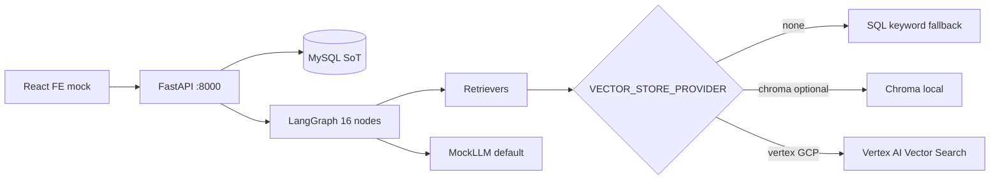

# memory-rag backend

Production-oriented FastAPI backend for a generic AI swing coaching demo.

**You can run everything locally without API keys, GCP, or Chroma.** Defaults: `LLM_PROVIDER=mock`, `VECTOR_STORE_PROVIDER=none` (MySQL SQL retrieval only).

## Project overview

| Layer | Technology | Role |
|-------|------------|------|
| API | FastAPI | REST + OpenAPI (`/docs`) |
| Source of truth | MySQL 8 | Users, swings, conversations, memories, knowledge chunks |
| Workflow | LangGraph | 16-node coach pipeline (quality loop + tools) |
| RAG framework | LlamaIndex-oriented retrievers | SQL fallback by default; optional Chroma / Vertex Vector Search |
| LLM | Provider abstraction | **mock** (default), optional Gemini API / Vertex / OpenAI |
| Deploy (later) | Cloud Run, Cloud SQL, GCS, Vertex | See [docs/manual_setup_later.md](docs/manual_setup_later.md) |

Real video/pose analysis is **out of scope**; swing analysis is structured mock data.

## Architecture



## Architecture policy

- See [docs/interface_policy.md](docs/interface_policy.md) for interface/implementation boundaries, naming, fallbacks, and node responsibilities.
- **Local default:** `LLM_PROVIDER=mock`, `VECTOR_STORE_PROVIDER=none`
- **Production target:** Vertex AI Gemini + Vertex AI Vector Search (+ optional GCS storage)

## Why this stack

- **MySQL** — relational SoT for service data and audit trails (profiles, swings, messages, eval logs).
- **LangGraph** — explicit, testable coach workflow with trace and guardrails.
- **LlamaIndex** — retrieval framework; local MVP uses SQL without installing vector libs.
- **Vertex AI Vector Search** — preferred GCP production vector backend (skeleton only until GCP is configured).
- **Cloud Run** — recommended API deployment target (artifacts under `infra/gcp/`).

## Quick start (local, no API keys)

### 1. MySQL (Docker)

```powershell
cd demo/be/infra/docker
copy .env.example .env
# Set MYSQL_ROOT_PASSWORD and MYSQL_PASSWORD in .env (gitignored)
docker compose up -d
docker compose ps
```

MySQL 8 · database `memory_rag` · credentials in `infra/docker/.env` (see `.env.example`) · port `3306`.

### 2. Environment

```powershell
cd demo/be
copy .env.example .env
```

Set `DB_PASSWORD` in `.env` to match `MYSQL_PASSWORD` in `infra/docker/.env`.  
Default `.env` uses `LLM_PROVIDER=mock` and `VECTOR_STORE_PROVIDER=none`.

### 3. Python dependencies (core only)

```powershell
python -m venv .venv
.\.venv\Scripts\activate
pip install -r requirements.txt
```

Optional Chroma / GCP / OpenAI (not required locally):

```powershell
pip install -r requirements-optional.txt
```

### 4. Migrations

```powershell
$env:PYTHONPATH="."
alembic upgrade head
```

Creates 12 tables: `users`, `user_profiles`, `swing_sessions`, `swing_analysis_results`, `conversations`, `messages`, `long_term_memories`, `knowledge_documents`, `knowledge_chunks`, `feedback_logs`, `prompt_versions`, `eval_logs`.

### 5. Seed data

```powershell
python scripts/seed_demo_data.py
```

Creates demo user **Riley** (`user_id=1` typically), 5 swing sessions, memories, knowledge docs, prompt `v0.3`.

Re-run is idempotent (skips if Riley exists). Clean slate: `python scripts/reset_db.py` then seed again.

### 6. Run API

```powershell
$env:PYTHONPATH="."
uvicorn app.main:app --reload --host 0.0.0.0 --port 8000
```

Or: `.\scripts\run_local.ps1`

- Docs: http://localhost:8000/docs  
- Health: http://localhost:8000/api/health  

### LangSmith APAC & LangGraph Studio (optional)

- [docs/langsmith_studio_setup.md](docs/langsmith_studio_setup.md) — APAC tracing + smoke tests
- [docs/langgraph_studio_setup.md](docs/langgraph_studio_setup.md) — **16-node** coach graph in Studio (`memory_rag_coach`)

```bash
cd demo/be && source .venv/bin/activate
export PYTHONPATH=.
./scripts/run_studio.sh
# or: langgraph dev --config langgraph.json --studio-url https://apac.smith.langchain.com
```

### Local logs

With default `.env` (`APP_ENV=local`, `LOG_TO_FILE=true`, `LOG_DIR=logs`), each server process writes a timestamped log file:

```text
demo/be/logs/20260604_213015.log
```

- Console output stays enabled (`LOG_JSON=false` uses a readable format).
- HTTP logs can include `request_id` when set by middleware.
- Set `LOG_TO_FILE=false` for stdout only.
- **Cloud Run / production:** logs go to stdout (`APP_ENV=prod` or `ENABLE_CLOUD_LOGGING=true`); Cloud Logging collects stdout, not local files under `logs/`.

The `demo/be/logs/` directory is gitignored.

### 7. Tests

```powershell
$env:PYTHONPATH="."
$env:LLM_PROVIDER="mock"
$env:DATABASE_URL="sqlite:///:memory:"
$env:VECTOR_STORE_PROVIDER="none"
pytest -q
```

## API examples

```bash
curl http://localhost:8000/api/health

curl http://localhost:8000/api/users/1/profile

curl http://localhost:8000/api/users/1/swing-sessions

curl -X POST http://localhost:8000/api/users/1/swing-sessions \
  -H "Content-Type: application/json" \
  -d "{\"club_type\":\"Driver\",\"view_type\":\"Front\",\"concern\":\"Slice\"}"

curl http://localhost:8000/api/swing-sessions/1/analysis

curl -X POST http://localhost:8000/api/coach/chat \
  -H "Content-Type: application/json" \
  -d "{\"user_id\":1,\"conversation_id\":null,\"message\":\"Why do I keep slicing?\"}"

curl -X POST http://localhost:8000/api/feedback \
  -H "Content-Type: application/json" \
  -d "{\"user_id\":1,\"message_id\":1,\"feedback_type\":\"helpful\"}"

curl http://localhost:8000/api/dev/prompt-versions
curl http://localhost:8000/api/dev/conversations/1/trace
```

## LangGraph workflow

16-node coach graph with conditional routing (`app/graph/workflow.py`):

1. `load_context` → `classify_question` → `retrieve_profile` → `retrieve_swing_history` → `retrieve_memory` → `retrieve_knowledge` → `invoke_tools` → `generate_answer` → `validate_output`  
2. Quality loop: `evaluate_answer` → `rewrite_query` (retry retrieval) or `fallback_answer`  
3. `guardrail` → `save_messages` → optional `update_memory` → `log_eval`

Each node appends to `state["trace"]` for `/api/dev/conversations/{id}/trace` and LangSmith (when enabled).

## RAG and vector strategy

| `VECTOR_STORE_PROVIDER` | When | Behavior |
|-------------------------|------|----------|
| **`none`** (default) | Local MVP | No Chroma/Vertex imports at runtime; SQL keyword search on `knowledge_chunks` |
| `chroma` | Optional local | Lazy-import LlamaIndex + Chroma (`CHROMA_PERSIST_DIR`); requires `requirements-optional.txt` |
| `vertex` | GCP production | Vertex AI Vector Search skeleton; needs `VERTEX_VECTOR_*` IDs + optional GCP SDK |

MySQL always stores chunk text and `vector_id`. Vector backends are optional acceleration layers.

## Memory strategy

- **Short-term:** `messages` per conversation  
- **Long-term:** `long_term_memories` updated when `ENABLE_MEMORY_UPDATE=true`  
- **Knowledge:** `knowledge_documents` / `knowledge_chunks` + ingest API  

## What does not require manual setup yet

No GCP project, billing, service account keys, Vertex index, Cloud SQL, Cloud Run deploy, Secret Manager, GCS, OpenAI key, or Chroma install.

See [docs/manual_setup_later.md](docs/manual_setup_later.md) for the full GCP checklist.

## Real LLM demo mode (Vertex Gemini)

Use this after local mock MVP passes. **pytest stays on mock** — no GCP calls in tests.

### 1. Install optional deps

```powershell
pip install -r requirements-optional.txt
```

### 2. Configure `.env`

```env
LLM_PROVIDER=vertex
VERTEX_PROJECT_ID=your-gcp-project-id
VERTEX_LOCATION=us-central1
VERTEX_MODEL_NAME=gemini-1.5-flash
VECTOR_STORE_PROVIDER=none
GOOGLE_APPLICATION_CREDENTIALS=C:/path/to/service-account.json
```

Or use Application Default Credentials: `gcloud auth application-default login`

Optional tracing:

```env
LANGSMITH_TRACING=true
LANGSMITH_API_KEY=your_langsmith_key
LANGSMITH_PROJECT=memory-rag-local
```

### 3. Run API (MySQL + seed as in Quick start)

```powershell
$env:PYTHONPATH="."
uvicorn app.main:app --reload --host 0.0.0.0 --port 8000
```

### 4. Smoke test

```powershell
python scripts/smoke_vertex_chat.py
```

Or curl:

```bash
curl -X POST http://localhost:8000/api/coach/chat \
  -H "Content-Type: application/json" \
  -d "{\"user_id\":1,\"conversation_id\":null,\"message\":\"Why do I keep slicing?\"}"
```

`VertexAIClient` calls Gemini for `classify_question_sync`, `generate_structured_answer_sync`, and `extract_memory_sync`. JSON parse failures fall back to keyword/mock logic; missing `VERTEX_PROJECT_ID` fails at client startup.

Later, switch vectors only: `VECTOR_STORE_PROVIDER=vertex` + `VERTEX_VECTOR_*` IDs (see [docs/manual_setup_later.md](docs/manual_setup_later.md)).

## Optional LangSmith tracing

**LangGraph** orchestrates the coach workflow. **LangSmith** is optional external observability for tracing and debugging. It does **not** replace MySQL `eval_logs` or the Dev trace API.

Default: `LANGSMITH_TRACING=false` — no API key required.

To enable locally:

1. Create a [LangSmith](https://smith.langchain.com) account and API key.
2. Add to `.env` (do not commit keys):

```env
LANGSMITH_TRACING=true
LANGSMITH_API_KEY=your_langsmith_key
LANGSMITH_PROJECT=memory-rag-local
LANGSMITH_ENDPOINT=https://api.smith.langchain.com
```

3. Restart the API and call `POST /api/coach/chat`.
4. Open your LangSmith project and inspect the `memory-rag-coach-workflow` run.

Configured at startup via `app/core/observability.py` (`configure_langsmith`). LangGraph invokes use run name + metadata (`user_id`, `llm_provider`, `vector_store_provider`, etc.).

## Frontend integration (connected)

The main demo flow in `demo/fe` calls this API. See [docs/fe_integration.md](docs/fe_integration.md).

```powershell
# demo/fe/.env.local
VITE_API_BASE_URL=http://localhost:8000
VITE_DEMO_USER_ID=1

cd demo/fe
pnpm install
pnpm dev
```

Connected: Home, Upload, Analysis, AI Coach, Dev (prompt versions + LangGraph trace). Profile, Routine, and Monthly Report use static demo data.

## GCP-ready layout

| Path | Purpose |
|------|---------|
| `infra/docker/` | Dockerfile + MySQL Compose |
| `infra/gcp/` | Cloud Run, Cloud Build, `env.example.yaml`, Terraform skeleton |
| `infra/k8s/` | Optional GKE manifests |
| `infra/gcp/README.md` | GCP deployment notes |

Recommended production: **Cloud Run + Cloud SQL + Vertex AI Vector Search + Vertex Gemini**.

## Limitations

- Mock LLM and mock swing analysis  
- No SSE streaming, Redis, or auth  
- Vertex embeddings in vector skeleton are placeholders  
- LangSmith requires explicit opt-in (`LANGSMITH_TRACING=true`)  

## Next steps

1. Replace placeholder Vertex embeddings with production models  
2. Deploy to GCP when manual setup is done (see [docs/manual_setup_later.md](docs/manual_setup_later.md))  
3. Add auth and rate limiting for `/api/dev/*` in production  

## Project layout

```
app/api/          HTTP routes
app/services/     Business logic
app/repositories/ DB access
app/core/         config, logging, observability (optional LangSmith)
app/graph/        LangGraph workflow + nodes
app/rag/          Retrievers + vector_store/
app/llm/          BaseLLMClient + factory (mock / vertex / openai)
app/storage/      BaseStorageService + local / GCS
alembic/          Migrations
scripts/          seed_demo_data, reset_db, smoke_vertex_chat.py, run_local.ps1
tests/            api, services, graph, rag modules
docs/             manual_setup_later, fe_integration
```
